# 한국 주소 데이터 전처리 자동화 파이프라인

본 프로젝트는 80만 건에 달하는 대규모 한국 주소 데이터를 Juso API와 자동화 스크립트를 통해 빠르고 정확하게 정제하는 파이프라인 구축 사례입니다.

단순 반복 작업으로 한 달 이상 소요될 것으로 예상되었던 데이터 전처리 작업을 자동화하여 **단 하루 만에 100%의 정확도로 완료**한 기술적 성과를 담고 있습니다.

---

## 📊 포트폴리오 슬라이드

> 아래 슬라이드 이미지를 통해 프로젝트의 전체적인 문제 해결 과정, 아키텍처, 핵심 기술 및 성과를 확인하실 수 있습니다.
> [전체 슬라이드 PDF 다운로드](./slides.pdf)

### 1. 프로젝트 개요
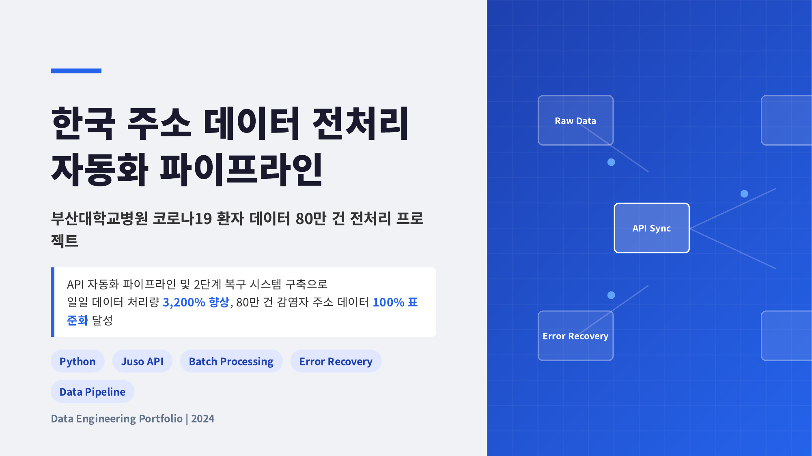

### 2. 문제 상황: 80만 건 처리를 가로막는 두 가지 장벽
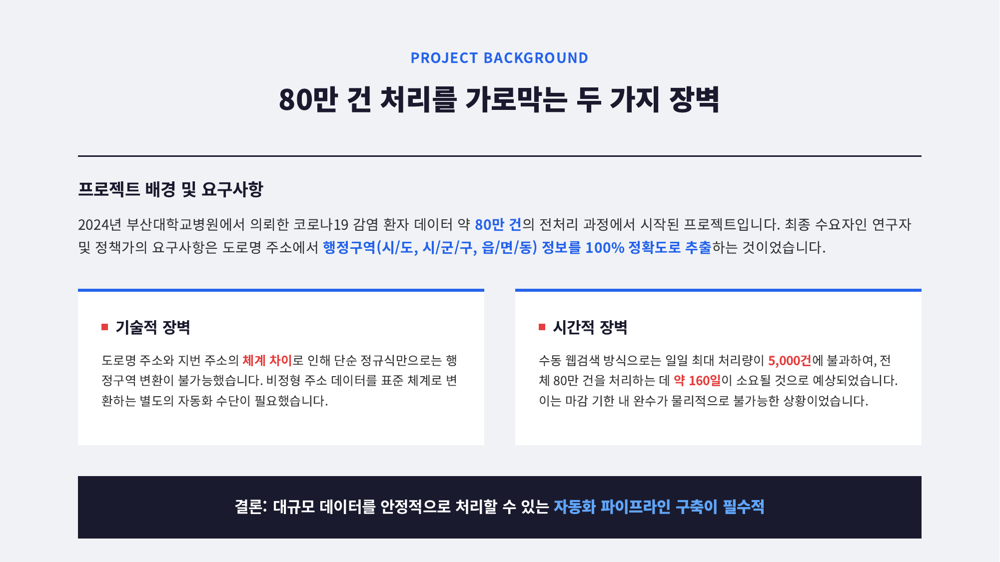

### 3. 해결책 발견: Juso API 분석으로 자동화 가능성 확인
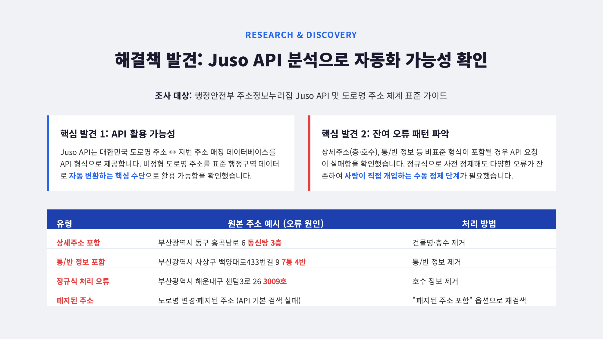

### 4. 기술 스택: 데이터 안정성을 보장하는 핵심 설계
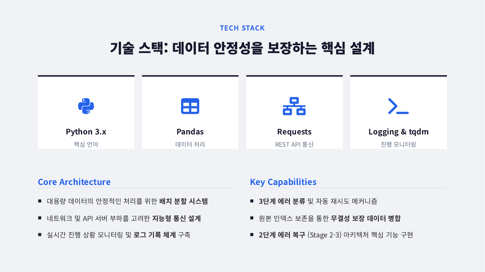

### 5. 아키텍처 1: 6단계 파이프라인 전체 구조
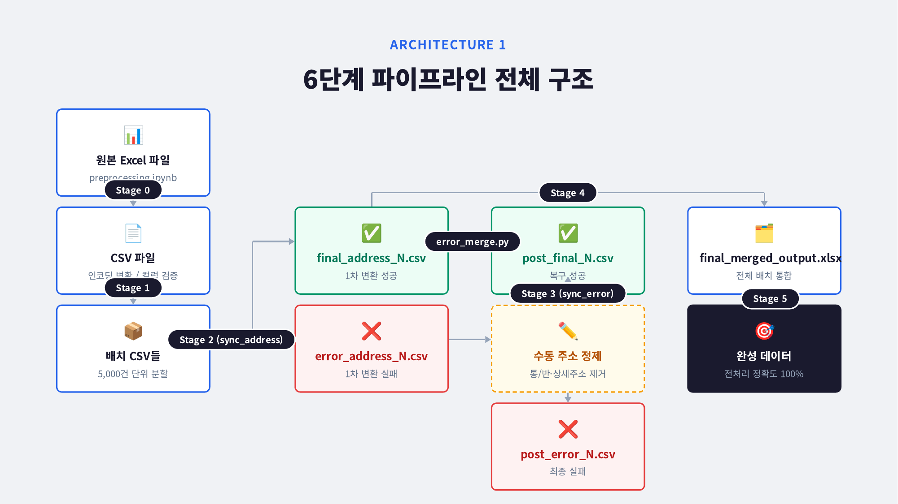

### 6. 지능형 API 재시도 로직: 3단계 에러 분류로 안정성 확보
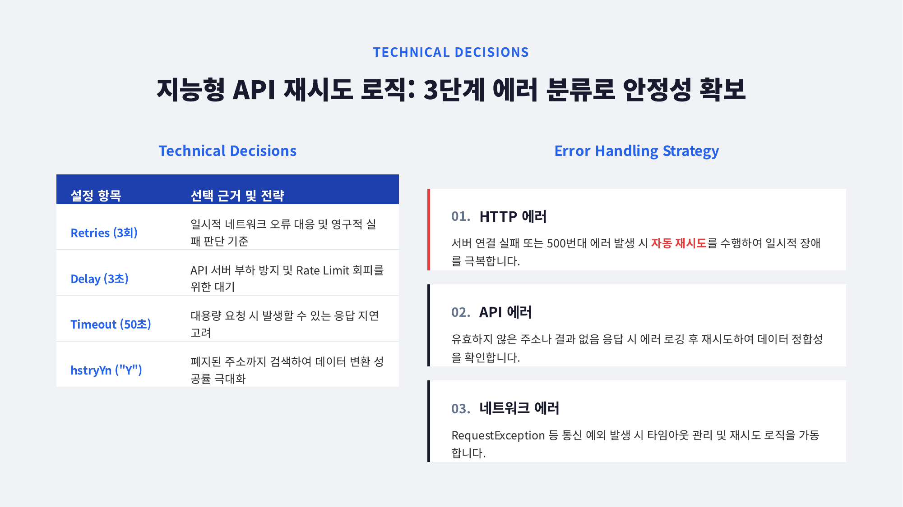

### 7. 5,000건 배치 전략: 처리 효율과 장애 복구의 최적 균형점
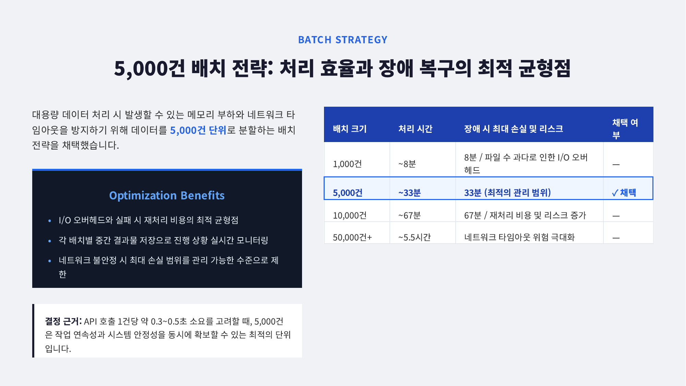

### 8. 아키텍처 2: 2단계 에러 복구 시스템
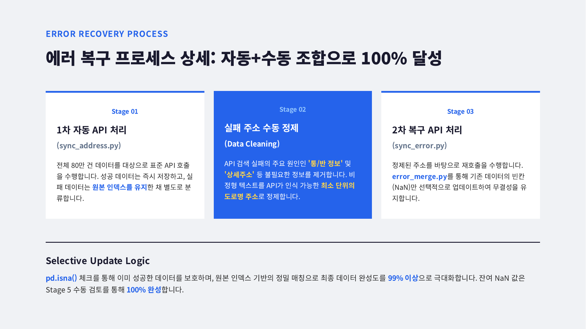

### 9. 2단계 에러 복구 시스템 상세: 자동+수동 조합으로 100% 달성
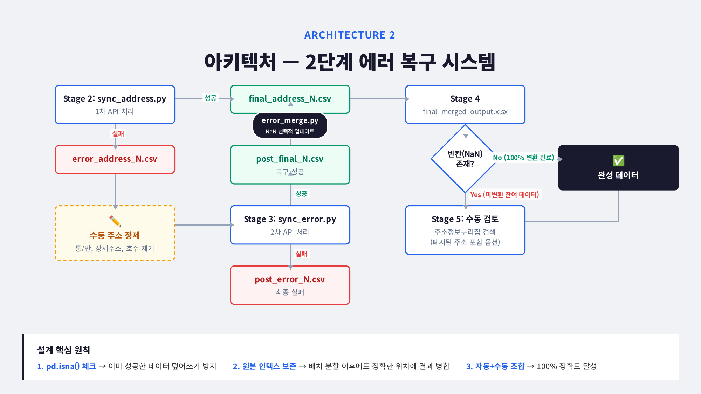

### 10. 실행한 액션: 파이프라인 구축부터 팀 표준화까지
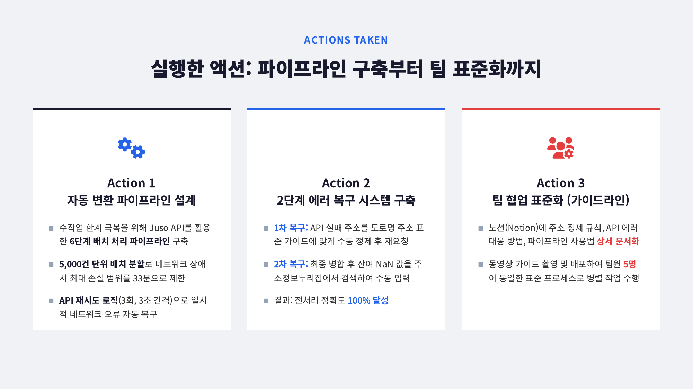

### 11. 프로젝트 성과: 일일 처리량 3,200% 향상
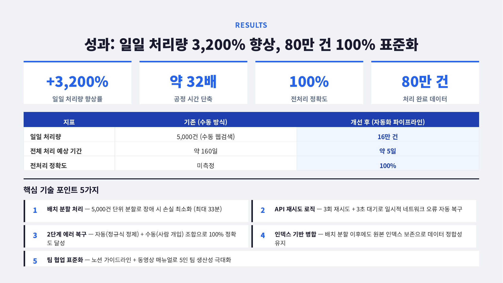

---

## 🛠 주요 기술 및 특징

- **Python & Pandas:** 대용량 데이터(80만 건)를 5,000건 단위의 배치로 분할하여 메모리 초과를 방지하고 안전하게 처리
- **Juso API 연동:** `requests` 라이브러리를 활용한 공공 데이터 포털 API 통신 및 JSON 응답 파싱
- **지능형 재시도 로직:** 네트워크 타임아웃, 일시적 오류에 대응하는 백오프(Backoff) 기반 재시도 메커니즘
- **에러 복구 시스템:** 1차 실패 데이터(NaN)를 별도로 분리하여 수동 정제 후, 원본 인덱스를 보존하며 병합(`pd.isna()` 활용)하는 무결성 설계

## 📈 핵심 성과 요약

1. **시간 단축:** 예상 소요 시간 1개월 → **1일 (약 3,200% 향상)**
2. **데이터 정확도:** 80만 건의 주소 데이터를 **100% 누락 없이 표준화 완료**
3. **팀 생산성 기여:** 파이프라인 구조를 표준화하여 향후 유사한 주소 데이터 전처리 작업 시 즉시 재사용 가능한 시스템 구축
